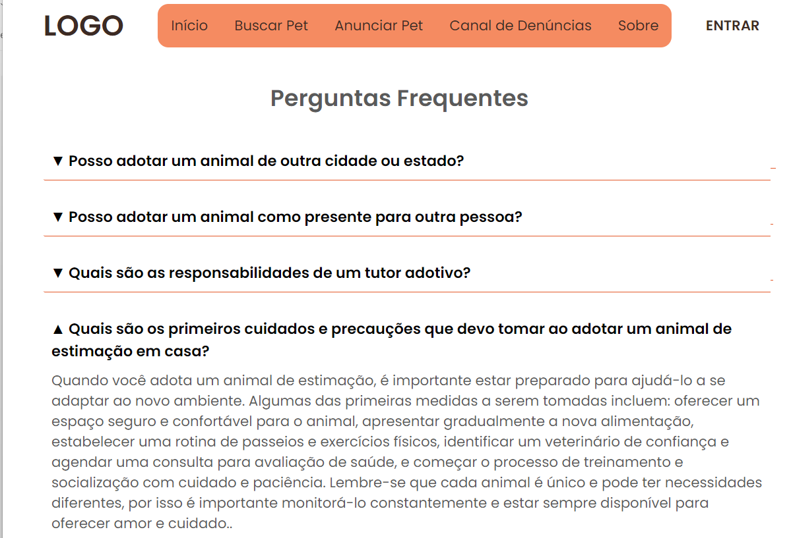
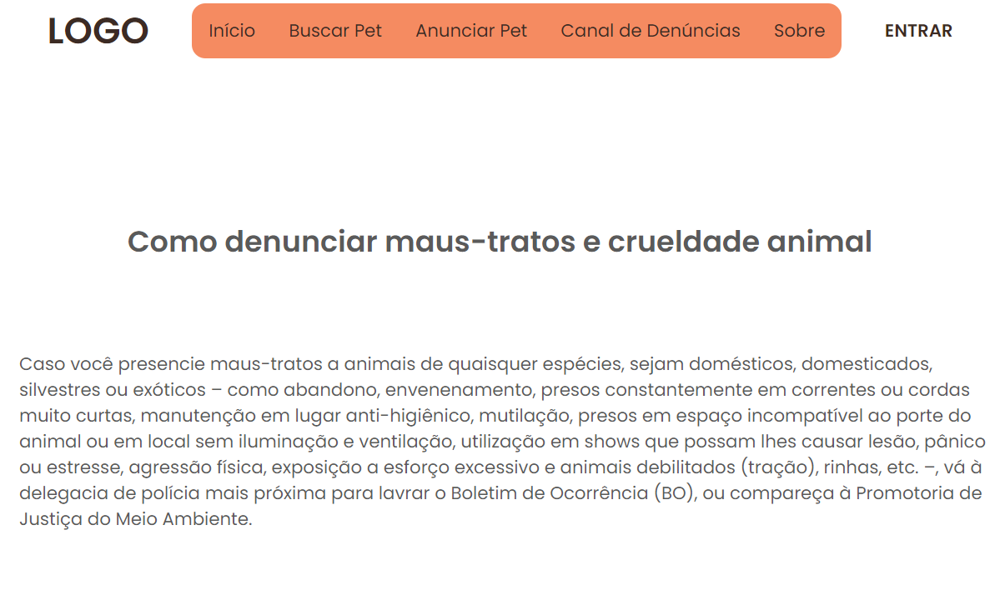

# Registro de Testes de Software

Os resultados obtidos nos testes de software realizados são descritos abaixo.

## Registro de Testes do RF-03

**CT-02**-Verificação da seção de perguntas frequentes 
Conforme apresentado na imagem abaixo, a página de perguntas frequentes carrega completamente, inclui informações relevantes sobre os primeiros cuidados com o animal adotado e permite que os usuários expandam ou contraiam as respostas  

  

## Registro de Testes do RF-07

**CT-06**-Conteúdo legal sobre crimes de maus tratos e abandono. 
Conforme apresentado na imagem abaixo, a página de canal de denúncia carrega completamente e contém informações sobre os crimes de maus tratos e abandono de animais, incluindo uma descrição das ações que são consideradas como tais.   

  

